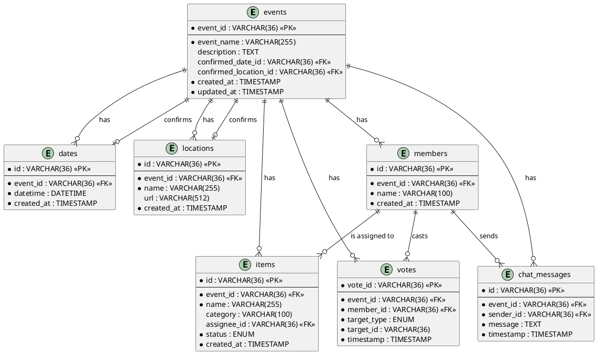

# データベース図表

このディレクトリには、花見調整サイトのデータベース設計に関する図表が含まれています。

## ER図

ER図（Entity-Relationship図）は、データベースの構造を視覚的に表現したものです。
各テーブル（エンティティ）と、テーブル間の関係（リレーションシップ）を示しています。

### PlantUML版ER図

PlantUMLを使用してER図を作成する場合は、以下のコードを使用できます：

## その他の図

データベース設計に関するその他の図表（例：テーブル間の関係図、データフロー図など）も追加される予定です。